  

  

  

 <picture>
  <source media="(prefers-color-scheme: dark)" srcset="https://raw.githubusercontent.com/Hoshino7/Hoshino7/output/pacman-contribution-graph-dark.svg">
  <source media="(prefers-color-scheme: light)" srcset="https://raw.githubusercontent.com/Hoshino7/Hoshino7/output/pacman-contribution-graph.svg">
  
</picture>

  
  

  

