  

  

  <h3>Hi there! 👋 I'm Kinochiwan (Muhammad Putra)</h3>
  

    <em>Computer Engineering student & hardware enthusiast based in East Kalimantan.</em> 
    When I'm not busy writing C++/Python code or wiring up ESP32 sensors for IoT projects, 
    you'll probably find me exploring creative tech, drawing, or diving into anime and digital worlds.
  

 

  

  
  
  
  
  
  

 

  

  <picture>
    <source media="(prefers-color-scheme: dark)" srcset="https://raw.githubusercontent.com/Hoshino7/Hoshino7/output/github-contribution-grid-snake-dark.svg">
    <source media="(prefers-color-scheme: light)" srcset="https://raw.githubusercontent.com/Hoshino7/Hoshino7/output/github-contribution-grid-snake.svg">
    
  </picture>

  
  

 

  

